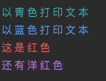
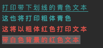
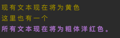

# Go彩色输出-color

## 什么是 color？

[color](https://github.com/fatih/color) 可以让你根据Go中的[ANSI转义码](http://en.wikipedia.org/wiki/ANSI_escape_code#Colors) 使用彩色输出。它也支持Windows！它可以用多种方式使用，选择一种适合您的方式。

## 为什么需要彩色输出?

彩色输出可以直观的区分信息、突出重点，也可以美化终端显示效果。

## 快速使用 color

### 安装color

```shell
go get github.com/fatih/color
```

### 入门案例

```go
// 默认打印
color.Cyan("以青色打印文本")
// 格式化输出
color.Blue("以%s打印文本", "蓝色")
// 其他示例
color.Red("这是红色")
color.Magenta("还有洋红色")
```


```go
// 创建新的color对象
c := color.New(color.FgCyan).Add(color.Underline)
c.Println("打印带下划线的青色文本")

// 或者将参数一起放到New()里
d := color.New(color.FgCyan, color.Bold)
d.Printf("这%s将打印粗体青色\n", "也")

// 将前景和背景色混合，创建新的组合
red := color.New(color.FgRed)

boldRed := red.Add(color.Bold)
boldRed.Println("这将以粗体红色打印文本")

whiteBackground := red.Add(color.BgWhite)
whiteBackground.Println("带白色背景的红色文本")
```


```go
// 使用方便的标准颜色
color.Set(color.FgYellow)

fmt.Println("现有文本现在将为黄色")
fmt.Printf("这里%s一个\n", "也有")

color.Unset() // 不要忘记unset

// 也可以混合使用
color.Set(color.FgMagenta, color.Bold)
defer color.Unset() // 在函数中可以使用defer去unset

fmt.Println("所有文本现在将为粗体洋红色。")
```



## 总结

color可以帮助我们实现Golang编写的多姿多彩的终端工具，希望大家可以借此开发出更多实用且有趣的东西。

## 参考链接

https://github.com/fatih/color


