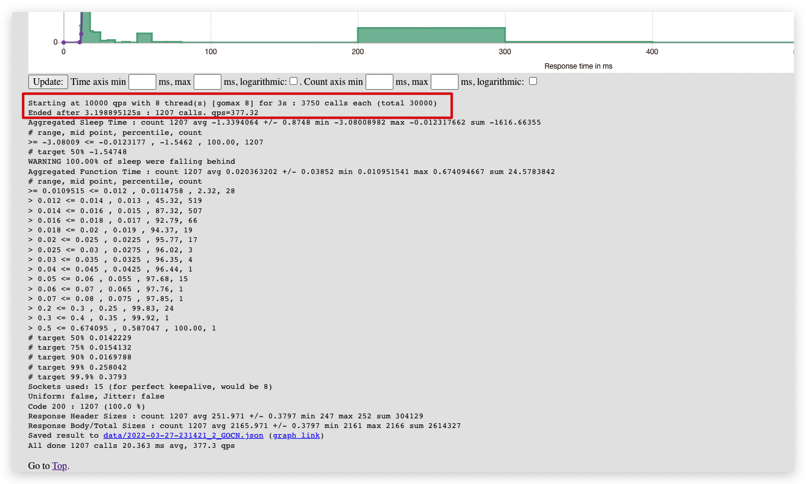

# 负载均衡测试工具 Fortio

## 背景介绍

日常开发中通常需要知道系统能承受的最大负载，不满足当前需求时对系统软硬件进行相应的优化或升级。今天推荐的工具 [Fortio](https://github.com/fortio/fortio) 就是用来测试系统能承受负载信息的工具，它运行一个设定的时间内固定的调用次数，或直到中断（在一个恒定的目标QPS，或每个连接/线程的最大速度/负载）或其它加载方式来观察不同负载下系统的响应时间和数据吞吐量，以检验系统的行为和特性并记录执行时间详细情况，以共我们发现系统可能存在的性能瓶颈、不能实时同步等问题。

除此之外 [Fortio](https://github.com/fortio/fortio) 还包括一组服务器端功能（类似于 httpbin），以帮助调试和测试服务：请求响应，包括头文件，添加延迟或错误代码的概率分布，tcp回显，tcp代理，https 等等，测试结果还能图形化展示或者json 格式保存。

## 怎么使用 Fortio?

第一步：安装

```go
go get fortio.org/fortio
```

第二步：启动服务

```shell
fortio
```

启动服务成功后可以用浏览器访问它的 web 用户界面 `http://localhost:8080/fortio/` 会看到一下页面：


页面中填写测试对象相关信息后点击 `Start` 按钮开始，测试完成后跳转到测试结果页面，再结果页面,部分结果内容如下：


除了 Web 端外，Fortio 还支持强大的命令行参数的进行负载测试，终端中以下格式输入确定即进行测试:`fortio load -c 100 -n 20 -qps 1000 https://gocn.vip/`

常用命令行参数如下：

| **Flag** | **Description, example** |
| --- | --- |
| load | 收集统计信息 |
| server | 启动简单的http和grpc ping服务器 |
| report | 浏览中展示结果 |
| grpcping | 命令发出grpc ping消息 |
| -qps rate | 每秒查询数或0表示无等待/最大qps |
| -c connections | 并行同时连接数（和匹配的go例程） |
| -t duration | 运行测试的时间（例如-t 30m30分钟）或0运行到^C，例如（默认5s） |
| -n numcalls | 运行此数量的调用而不是持续时间。默认值（0）是使用持续时间（-t）。 |
| -r resolution | 以秒为单位的直方图最小存储桶的分辨率（默认为0.001，即1ms），使用预期典型延迟的1/10 |
| -H "header: value" | 可以多次指定以添加标头（包括主机：） |
| -a | 根据标签和时间戳自动保存带有文件名的JSON结果 |
| -json filename | stdout输出json结果的文件名或-（默认相对于-data-dir），如果希望fortio report显示它们，则应以.json结尾；使用-a通常是更好的选择） |

以上是常用的基本命令参数，更多命令参数请在终端输入 `fortio help` 查看。


## 总结

[Fortio](https://github.com/fortio/fortio) 是非常成熟的一个负载测试工具，维护者们也很活跃；可以用它负载测试，还可以把集成到企业内部测试工具中构建出更强大的测试工具，Fortio 的代码质量相当好，感兴趣可以阅读其源码学习并做出贡献。

## 参考资料

- [Fortio](https://github.com/fortio/fortio)
- [Fortio Documentation](https://pkg.go.dev/fortio.org/fortio/version)
